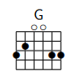

# songbook

This is the songbook template used by my local scout group. You are free to use and modify it.
Because this songbook is using the [LaTeX Songs Package](http://songs.sourceforge.net/), it is licensed under the GPL v2.0. 
The original songs package itself has not been modified for this purpose. 
If you are using this as your template please be sure to share your sources as well. 
Happy singing :)

## How to Install

### prerequisites

The chordbook assumes that you have installed a few general latex-packages for using latex. 
Especially `pdflatex` and `luatex` are a must have. 
Windows users can get access to these via installing [MikTex](https://miktex.org/). 
I assume that users of true POSIX-systems know how to install software (or at least how to search for the information on google or duckduckgo) since they are superior ;)
Users of UNIX-based systems need to have `make` installed. 

You should also have installed the Latex-Songs-Package (see link above for more instructions). 

It is not really required but highly recommended to have a somewhat useful text editor installed. 
For non-keyboard-wizards, [TexMaker](https://www.xm1math.net/texmaker/) works just fine. 
Some however might prefer to use [Vim](https://www.vim.org/). 
Theoretically any text editor can be used, even Microsofts notepad. 

### general build instructions

On Windows just run `make.bat` inside the build directory. 

On Linux (Mac should work the same) just run `make` inside the build directory. 

For UNIX-based Systems there is also `make fine` which will produce a pdf file optimised for printing. However for this to work you may have to manually install the package pgfmorepages if your distribution does not supply it already. 

## Styleguide 

Generally I prefer the following layout: 
 - Every verse should be one line of code. That way, the songs package can work it's magic and put everything on the paper using a close-to-minimum amount of space. Now notice, I said "should". There are exceptions to the rule. For Instance, have a look at the following lyrics from "Junge" by "Die Ärzte": 

   ```
   ...
                 Dm                      Am
   Löcher in der Hose und ständig dieser Lärm
                   C
   (was sollen die Nachbarn sagen?)
   ...

   ```

In the given example it can make more sense to put the parenthesised part in its own line. For one, because it is sung as an echo to the first part, and secondly because it does not increase readability if it would not have its own line of song text, because the line would be too long and it would be broken up in two parts anyways. However, please note that in some songs it makes more sense to put such passages in one line with the rest. As an example consider this part from "Hit the road, Jack": 

	```
	...
	 F        E7                 Am             G
	Don't you come back no more. (aah! what you say)
	 F        E7                 Am             G
	Don't you come back no more. (I didn't understand you)
	...

	```

Here one line makes a lot of sense, because the line is short enough that it will not be broken in two. Also you have the same chords throughout the song in this exact sequence. Disrupting it by splitting it in two feels unnatural. As you can see it very much depends on the song. As a gerneral rule of thumb for most songs, putting every verse in one line is good advice. 

 - Make sure the guitar chords your song uses are already listed in the "song" named `Grifftabellen`. If it happens not to be there, first, please see [Enharmonic](https://en.wikipedia.org/wiki/Enharmonic). If you still are sure that your chord is not present, please feel free to add it yourself. The chords will look something similar to this: 

    

   Luckily, pictures like this can be generated using the songs package. For instance, the G-major-chord shown here can be created using the following code: `\gtab{G}{320033}`. Barchords can be produced like this: `\gtab{F}{(133211)}`. If you are using a barchord that is played in the 2nd, 3rd or above fret, use the following notation: `\gtab{Am}{5:(133111)}`. For further information please see the documentation of the songs package itself [LaTeX Songs Package Documentation](http://songs.sourceforge.net/songsdoc/songs.html). 
 - Please please please sort all guitar chords in the "song" `Grifftabellen` alphanumerically. As an example, assume we had to add the chord D7 to the chords D, D6, Dadd9 and Dm (all of which are already present). We would put it between the D6 and the Dadd9 chord (because it is sorted alpanumerically). If we then were to add a D7/F# however, we were to place it between the D7 and the Dadd9 (because alphanumerically the 7 is placed before the 'a' from add9). 
 - You can use the commands `\nlintro{\[Am] \[C] \[D7]}` (for non-lyrics) and `\intro{This \[Am]intro \[C]sounds \[D7]great} (for lyrics) to create an intro for your songs. There are also commands for solo, bridge and outro, have a look at commands.tex. If you make changes in this file it will change the behaviour of the commands globally. Know what you're doing. 
 - If your song has a really long chorus, consider making it an additional verse instead, since the songbook is better at correctly breaking pages with verses than it is with choruses. 
 - If your song has more than one chorus (e.g. pre-chorus and chorus), either merge both choruses to one chorus or merge the relevant verses with the first part of the chorus and then use the rest of the chorus normally. That way, we end up with a practical amount of used ink and paper. 
 - If your song is longer than two pages, please make sure that the guitarist can still play the chorus without having to flip pages every verse. This means that you should have your chorus printed on every 1st, 3rd, 5th and so on page. 
 - If you wish to add additional Information to a song, feel free to use `\beginscripture{}` and `\endscripture` after you ended a song with `\endsong` (you may refer to the documentation of the [songs package](http://songs.sourceforge.net/songsdoc/songs.html)). Example usage: 
```
...

D\[F]on't you \[E7]come back no more. (\[Am]I didn't under\[G]stand you)
\endverse

\vspace*{\fill}

\endsong
\beginscripture{}
This song is about ...
\endscripture
```

## Videos and documentation are inconsistent! 

If you don't know what this passage is, in short: I made a few videos where I talk about this stuff, showing examples. The videos are on YouTube, however they are not listed and I will not share the link publically. 
Now that you know, re-read the title of this section. 

In this case, the documentation here is right. This is because it takes a lot longer to make and re-make a video than to change up some words in a document like this. 

